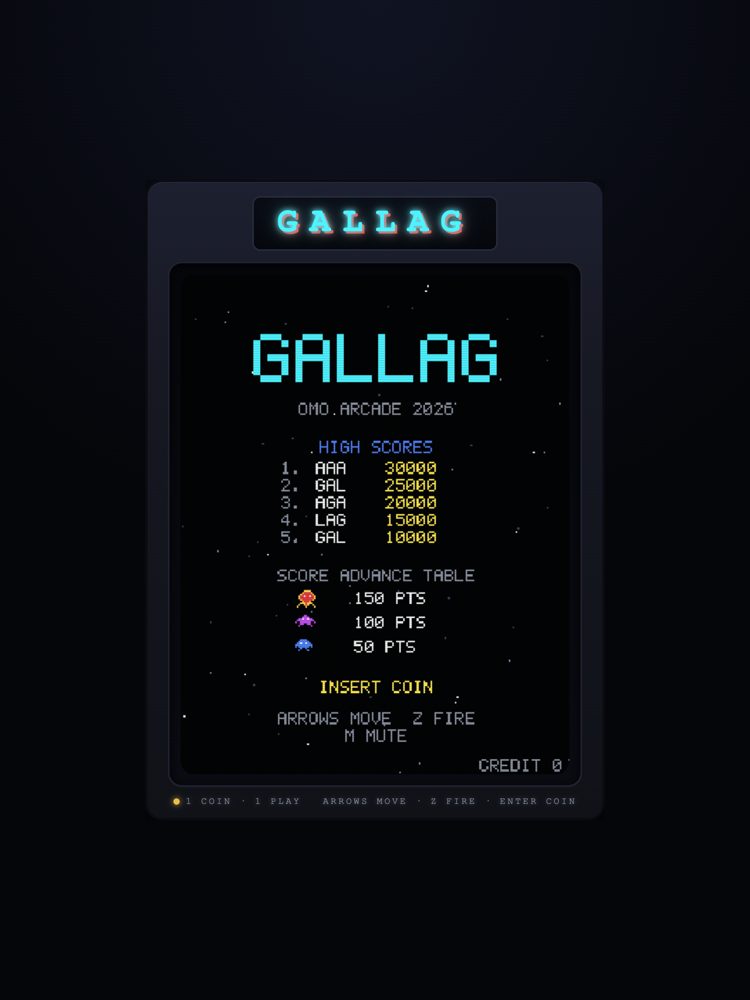
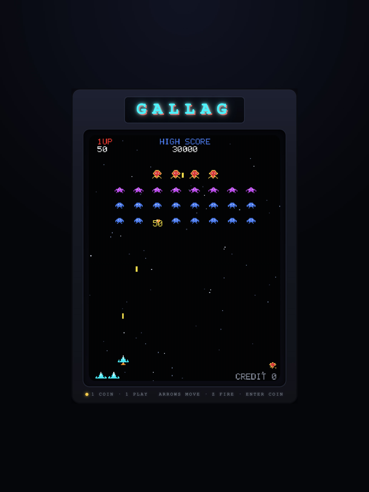

# GALLAG

A Galaga-style 2D fixed shooter that runs as a full 1981-style arcade cabinet in
the browser — glowing marquee, CRT scanlines and vignette, coin-slot attract
mode, synthesized chiptune SFX, and item power-ups.

**Built natively with [omo](https://github.com/code-yeongyu/oh-my-openagent).**
The whole game — strict-TypeScript code, unit tests, synthesized audio,
procedural pixel art, and a Playwright visual-QA suite — was produced by an
omo-native agent workflow, including a "Meticulous Game Director" review
subagent that iterated on the build until it approved.




## Play

- **Live (GitHub Pages):** https://code-yeongyu.github.io/gallag-omo-native/
- Move: **Arrow keys** (or A/D) · Fire: **Z** (or Space) · Coin/Start: **Enter** · Mute: **M**
- First Enter inserts a coin, second Enter starts. 1 coin = 1 play.

## Features

- Full arcade flow: attract mode with blinking INSERT COIN and hi-score table →
  stage intro → formation combat with diving attackers → challenge stage every
  3rd → GAME OVER → 3-letter initials entry → hi-score persisted to localStorage
- Item power-ups dropped by kills: **P** twin shot, **R** rapid fire,
  **S** shield (absorbs one hit), **B** bonus points, rare **1UP**
- Game feel: pixel-shard explosions, floating score popups, screen shake + red
  flash on death, dive swoosh warning, invulnerability blink, magnet item pickup
- Authentic presentation: 224×288 logical playfield, procedural pixel sprites,
  hand-drawn 5×7 bitmap font, 3-layer parallax starfield, CRT overlay
  (scanlines + aperture grille + vignette + flicker), WebAudio-synthesized
  chiptune SFX (coin, stage jingle, dive, explosions, item arpeggio, game over)

## Tech

- **TypeScript** (ultra-strict: `noUncheckedIndexedAccess`,
  `exactOptionalPropertyTypes`, `verbatimModuleSyntax`) + **Vite** + **pnpm**,
  zero runtime dependencies, Canvas 2D
- Fixed-timestep 60 Hz logic, seeded deterministic RNG
- **83 unit tests** (vitest, RED→GREEN), Biome lint/format
- Playwright visual-QA suite driving the real game through deterministic
  `?qa=1&seed=` debug hooks (14 scenario captures, zero-console-error gate)

## Develop

```bash
pnpm install
pnpm dev        # dev server
pnpm test       # unit tests
pnpm build      # production build -> dist/
pnpm preview    # serve the build
node scripts/qa/capture.mjs  # visual QA capture suite (needs a server on :4173)
```
